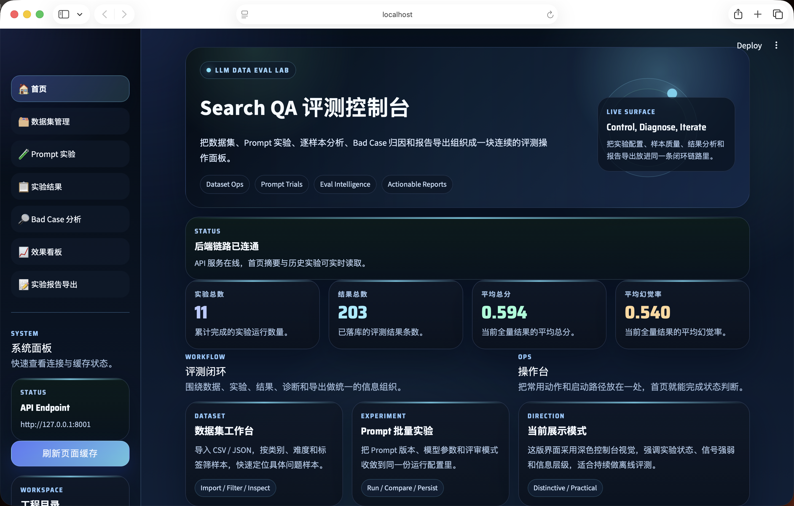
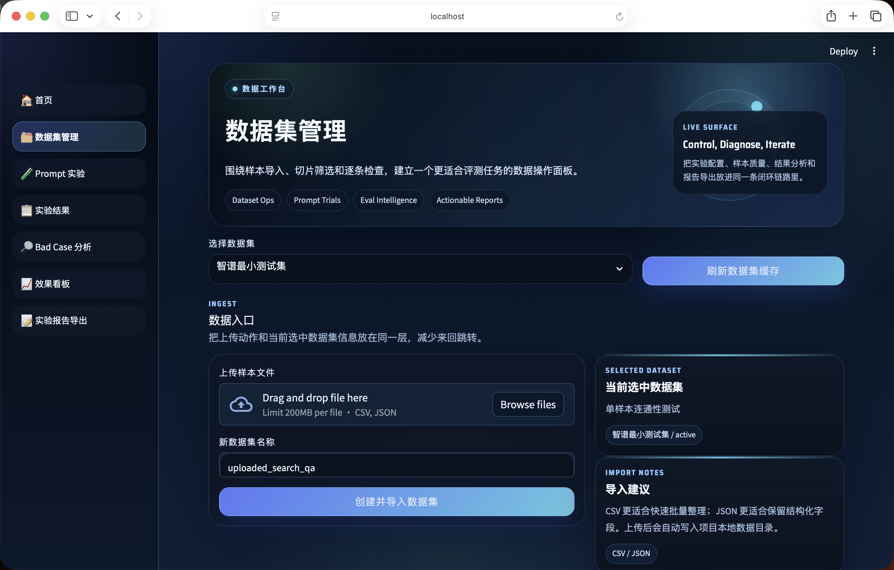
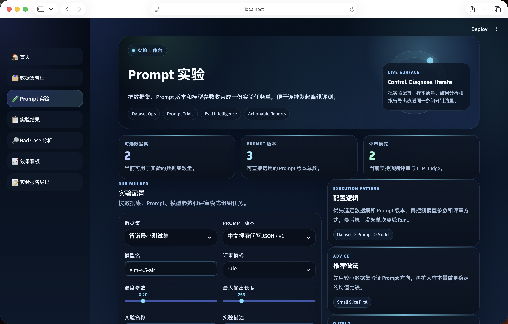
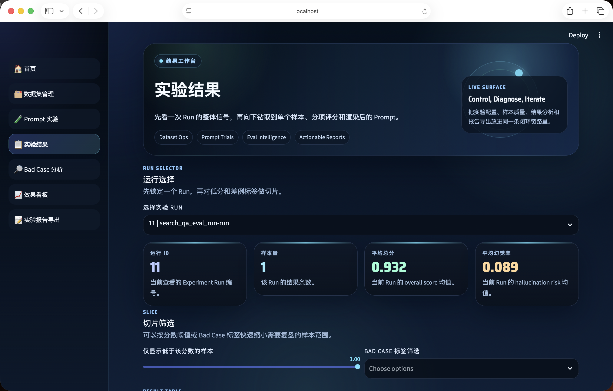
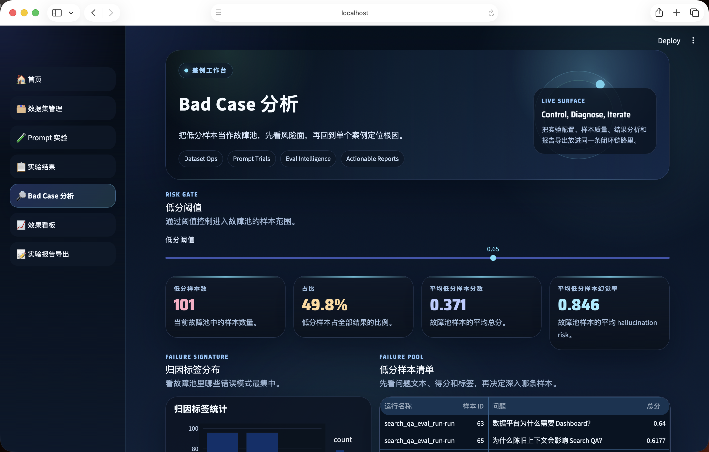
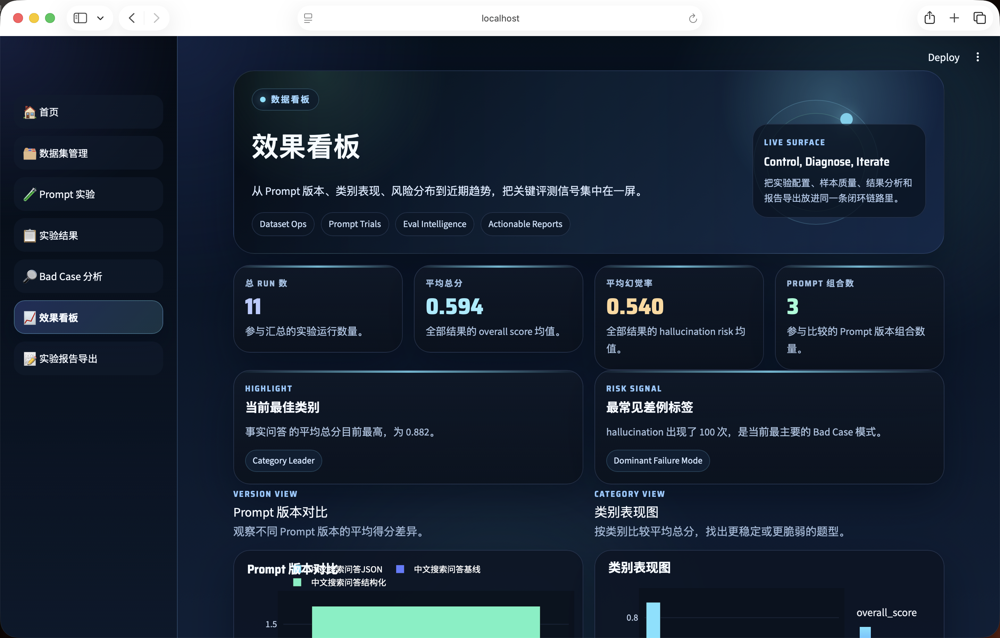

# LLM Data Eval Lab

> 一个面向 Search QA 场景的大模型数据评测与 Prompt 优化平台原型。
> 新版前端采用深色评测控制台界面，强调实验状态、风险信号和逐样本诊断。
> 它不是聊天机器人 Demo，而是把真实 AI 模型数据平台里的关键闭环做成一个可运行的开源项目：数据集管理、Prompt 版本管理、批量实验、自动评测、Bad Case 归因、效果分析、Dashboard 复盘与实验报告导出。

## 为什么这个项目值得看

- 完整闭环：覆盖 `数据集 -> Prompt -> 实验 -> 评测 -> 差例 -> 看板 -> 报告`，不只是单次 LLM 调用。
- 可直接演示：内置中文 Search QA 演示数据，默认支持 mock 模式，没有真实 API Key 也能完整跑通。
- 界面重构：前端采用深色控制台式布局，把运行状态、评分信号和分析入口组织在统一工作台里。
- 贴近真实工作流：包含 Prompt 版本、批量实验、低分样本分析、指标对比与 SQL 分析脚本。
- 易于扩展：后端基于 FastAPI，前端基于 Streamlit，保留真实 OpenAI 风格接口与 LLM judge 接入点。

## 核心工作流


## 界面预览

以下截图均来自当前仓库本地运行的新版前端，已同步为 GitHub 首页展示版本。

### 首页总览



### 核心工作台

| 数据集管理 | Prompt 实验 |
| --- | --- |
|  |  |
|  |  |

### 效果看板



> 所有截图文件位于 `docs/screenshots/`，对应当前深色控制台版本界面。

## 项目背景

随着大模型在搜索问答、知识问答、内容生产等场景中落地，团队越来越需要一类“模型数据平台型工具”来解决几个问题：

- 如何构建和维护离线评测集
- 如何对不同 Prompt 版本做批量实验
- 如何评估模型输出是否正确、完整、grounded
- 如何快速定位低分样本的失败原因
- 如何用看板和 SQL 分析结果变化

这个项目围绕上述问题设计，重点是把大模型数据平台中的关键环节串成一个可运行的开源原型，而不是只展示单次 LLM 调用。

## 项目目标

- 搭建一个可运行、可演示、可扩展的 LLM 数据评测平台原型
- 覆盖数据平台常见的产品闭环：数据集 -> Prompt -> 实验 -> 评测 -> 差例 -> 看板
- 在没有真实模型 API Key 的情况下也能完整跑通演示流程

## 功能清单

### 1. 数据集管理

- 支持创建数据集
- 支持查看样本表格
- 支持按类别、难度、标签筛选
- 支持查看样本详情
- 支持导入本地 CSV / JSON

### 2. Prompt 管理与实验

- 支持多 Prompt 及多版本管理
- 支持 system prompt + user prompt 模板
- 支持 few-shot 示例
- 支持选择模型名、temperature、max_tokens、judge 模式
- 支持一键运行批量实验

### 3. 模型评测

- rule-based 评分
- 评分维度包括：
  - correctness
  - completeness
  - groundedness
  - format_compliance
  - hallucination_risk
  - overall_score
- 预留 LLM-as-a-judge 接口
- 支持 mock 模式与真实 OpenAI 风格接口切换

### 4. Bad Case 分析

- 自动标记低分样本
- 自动归因 Bad Case 标签
- 查看典型失败样本
- 查看归因标签分布

### 5. Dashboard / 分析

- Prompt 版本平均分对比
- 各 category 表现图
- 幻觉率统计
- Bad Case 分布图
- 最近实验趋势
- 明细数据表格

### 6. 实验报告导出

- 支持选择两个 Prompt 版本生成对比报告
- 支持导出 Markdown / HTML
- 支持输出样本量、平均分差值、category 变化和典型案例对比

## 技术栈

- 后端：Python + FastAPI
- 前端：Streamlit
- ORM：SQLAlchemy
- 数据库：SQLite
- 数据处理：Pandas
- 可视化：Plotly + Streamlit
- LLM 调用：LangChain + OpenAI 风格接口封装
- 配置管理：`.env` + `pydantic-settings`
- 测试：pytest

## 快速启动

如果你只是想最快把 Demo 跑起来，可以按下面的顺序执行：

```bash
# terminal 1
python3 -m venv .venv
source .venv/bin/activate
pip install -r requirements.txt
cp .env.example .env
python scripts/seed_demo_data.py
uvicorn app.main:app --reload

# terminal 2
source .venv/bin/activate
streamlit run frontend/app.py
```

### 1. 安装依赖

```bash
python3 -m venv .venv
source .venv/bin/activate
pip install -r requirements.txt
```

### 2. 配置环境变量

```bash
cp .env.example .env
```

默认情况下可以不开真实 API Key，系统会走 mock 模式。

### 3. 初始化演示数据

```bash
python scripts/seed_demo_data.py
```

这会写入：

- 1 个中文演示数据集
- 33 条中文 Search QA 样本
- 3 个 Prompt 模板
- 默认 Bad Case 标签字典

### 4. 启动后端

```bash
uvicorn app.main:app --reload
```

打开：

- 后端接口文档：[http://127.0.0.1:8000/docs](http://127.0.0.1:8000/docs)

### 5. 启动前端

```bash
streamlit run frontend/app.py
```

打开：

- 前端页面：[http://localhost:8501](http://localhost:8501)

## 数据结构说明

### 核心表

#### datasets

- `id`
- `name`
- `description`
- `source_type`
- `source_path`
- `status`
- `sample_count`
- `created_at`
- `updated_at`

#### samples

- `id`
- `dataset_id`
- `query`
- `context`
- `reference_answer`
- `category`
- `difficulty`
- `tags`
- `notes`
- `created_at`
- `updated_at`

#### prompts

- `id`
- `name`
- `description`
- `task_type`
- `owner`
- `created_at`
- `updated_at`

#### prompt_versions

- `id`
- `prompt_id`
- `version`
- `system_prompt`
- `user_prompt_template`
- `few_shot_examples`
- `variables_schema`
- `change_note`
- `is_active`
- `created_at`
- `updated_at`

#### experiments

- `id`
- `name`
- `description`
- `dataset_id`
- `prompt_version_id`
- `target_model`
- `temperature`
- `top_p`
- `max_tokens`
- `judge_mode`
- `status`
- `created_at`
- `updated_at`

#### experiment_runs

- `id`
- `experiment_id`
- `run_name`
- `run_status`
- `started_at`
- `finished_at`
- `sample_total`
- `sample_completed`
- `avg_overall_score`
- `avg_correctness`
- `avg_groundedness`
- `avg_hallucination_risk`
- `error_message`
- `created_at`
- `updated_at`

#### evaluation_results

- `id`
- `experiment_run_id`
- `sample_id`
- `generated_answer`
- `rendered_prompt`
- `correctness`
- `completeness`
- `groundedness`
- `format_compliance`
- `hallucination_risk`
- `overall_score`
- `judge_detail`
- `is_bad_case`
- `created_at`
- `updated_at`

#### badcase_tags

- `id`
- `code`
- `name`
- `description`
- `severity`
- `created_at`
- `updated_at`

#### evaluation_result_badcase_tags

- `id`
- `evaluation_result_id`
- `badcase_tag_id`
- `created_at`
- `updated_at`

## 评测逻辑说明

当前版本采用 rule-based 评测器，并预留 LLM judge 接口。

### 评分逻辑

- `correctness`
  - 通过生成答案与参考答案的 token overlap 估算
- `completeness`
  - 通过生成答案与参考答案长度比例估算
- `groundedness`
  - 通过答案 token 与 context token 的覆盖比例估算
- `format_compliance`
  - 根据回答格式是否符合 JSON / bullet /结构化文本做启发式评分
- `hallucination_risk`
  - 根据 groundedness 和 correctness 反推
- `overall_score`
  - 按加权方式综合：
    - correctness 30%
    - completeness 20%
    - groundedness 25%
    - format_compliance 10%
    - 低幻觉程度 15%

### LLM Judge 设计

项目中已预留：

- 真实 OpenAI 风格接口
- LangChain 调用封装
- mock judge fallback

这样可以保证：

- 没 API Key 时，Demo 一样可跑
- 有 API Key 时，可以接真实模型评审

## Bad Case 标签体系说明

当前内置的 Bad Case 标签包括：

- `insufficient_context`
  - 上下文证据不足，难以安全回答
- `hallucination`
  - 回答包含超出 context 的不支持信息
- `incomplete_answer`
  - 回答不完整，缺少关键要点
- `format_error`
  - 输出格式不符合要求
- `instruction_following_failure`
  - 没有遵循 Prompt 中的明确指令
- `ambiguous_query`
  - 用户问题存在歧义，容易导致检索或生成偏差

这些标签的作用不是替代人工分析，而是帮助快速做第一轮失败模式聚类。

## 可扩展方向

### 多模态

- 将 `context` 扩展为图文混合输入
- 增加图像 grounding、图文一致性评测

### Code

- 将样本改为 `instruction + code context + expected behavior`
- 增加单元测试通过率、编译成功率、执行正确率等指标

### Search

- 接入检索日志
- 比较 query rewrite / reranker / chunking 策略
- 增加召回质量指标和检索链路分析

### Agent Workflow

- 增加多步任务链路评测
- 记录工具调用轨迹
- 评测计划能力、工具选择能力、终局正确性

## 项目结构

```text
data-eval/
├── app/
│   ├── core/
│   ├── models/
│   ├── schemas/
│   ├── services/
│   ├── utils/
│   └── main.py
├── frontend/
│   ├── app.py
│   ├── api_client.py
│   ├── bootstrap.py
│   ├── ui.py
│   └── pages/
├── scripts/
│   └── seed_demo_data.py
├── docs/
│   └── screenshots/
├── sql/
│   └── analysis_examples.sql
├── tests/
├── LICENSE
├── .gitignore
├── .env.example
├── requirements.txt
└── README.md
```

## 开源信息

- License: [MIT](LICENSE)
- 仓库已提供 [.gitignore](.gitignore)，默认忽略本地数据库、虚拟环境和上传文件

## 后续建议

建议优先继续做三件事：

1. 接入真实模型 API，并保留 mock fallback
2. 补齐单元测试和接口测试
3. 补演示视频、部署说明和 Docker 启动方式
